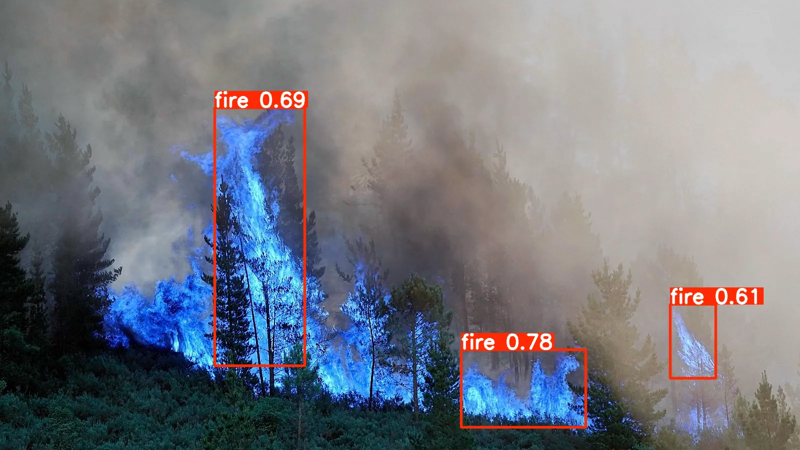

# Wildfire Fire & Smoke Detection

[](https://github.com/AaronPrado/forestfire-cv-detection/actions/workflows/ci.yml)

Pipeline end-to-end de Computer Vision para detectar fuego y humo de incendios forestales en imágenes usando YOLOv8.

## Descripción

Este proyecto implementa un pipeline MLOps completo: ingesta de datos desde Roboflow, procesamiento de imágenes, entrenamiento del modelo con tracking de experimentos (MLflow), registro de modelos, inferencia en tiempo real mediante una API REST y una demo pública interactiva. Detecta dos clases: fuego y humo.

Proyecto complementario: [fire-risk-pipeline](https://github.com/AaronPrado/fire-risk-pipeline) — Pipeline de predicción de riesgo de incendios forestales.

Demo pública: [huggingface.co/spaces/AaronPrado/wildfire-smoke-detection](https://huggingface.co/spaces/AaronPrado/wildfire-smoke-detection)

## Estructura del proyecto

```
forestfire-cv-detection/
├── .github/
│   └── workflows/
│       └── ci.yml               # CI/CD con GitHub Actions
├── configs/
│   └── config.yaml              # Configuración centralizada del proyecto
├── data/
│   └── .gitkeep
├── docker/
│   ├── Dockerfile               # Imagen Docker para la API
│   └── docker-compose.yml       # API + MLflow UI
├── spaces/
│   ├── app.py                   # Demo interactiva con Gradio (HF Spaces)
│   └── requirements.txt
├── src/
│   ├── cli.py                   # CLI unificado con Click
│   ├── ingestion/
│   │   └── download.py          # Descarga del dataset, subida a S3, generación de metadatos
│   ├── processing/
│   │   ├── validate.py          # Validación de imágenes y labels
│   │   ├── resize.py            # Redimensionado de imágenes
│   │   └── process.py           # Orquestador del pipeline de procesamiento
│   ├── training/
│   │   └── train.py             # Entrenamiento YOLOv8 con tracking y registro en MLflow
│   ├── serving/
│   │   └── app.py               # API REST con FastAPI
│   └── utils/
│       ├── config.py            # Carga centralizada de configuración y credenciales
│       ├── logging.py           # Logger estructurado
│       └── s3.py                # Funciones reutilizables de S3
├── tests/
│   ├── test_api.py              # Tests de los endpoints /predict y /health
│   ├── test_cli.py              # Tests del CLI
│   ├── test_config.py           # Tests de carga de configuración
│   ├── test_validate.py         # Tests de validación de imágenes y labels
│   └── test_resize.py           # Tests de redimensionado
├── .dockerignore
├── .env.example
├── .pre-commit-config.yaml      # Hooks de pre-commit (ruff, detect-private-key)
├── conftest.py
├── Makefile                     # Automatización de tareas
├── pyproject.toml               # Configuración del proyecto (ruff, pytest, dependencias)
├── requirements.txt
└── README.md
```

## Dataset

- **Fuente:** [Fire and Smoke Detection - METU (Roboflow)](https://universe.roboflow.com/middle-east-tech-university/fire-and-smoke-detection-hiwia)
- **Imágenes:** 15,337 (train: 13,423, valid: 1,277, test: 637)
- **Clases:** 2 (fire, smoke)
- **Formato:** YOLOv8 bounding boxes
- **Almacenamiento:** AWS S3

## Resultados del modelo

### YOLOv8s vs YOLOv8m (dataset METU)

| Métrica | YOLOv8s | YOLOv8m |
|---------|---------|---------|
| mAP50 | **0.599** | 0.573 |
| mAP50-95 | **0.258** | 0.258 |
| Precision | **0.619** | 0.612 |
| Recall | **0.601** | 0.573 |
| Epochs | 200 | 300 |
| Batch size | 32 | 16 |
| cos_lr | No | Si |
| Tiempo | ~18.7h | ~40.7h |

Modelo seleccionado: **YOLOv8s** — mejores métricas, la mitad de tamaño y el doble de rápido. El cuello de botella es la calidad del dataset, no la capacidad del modelo.

### Dataset anterior (brad-dwyer)

| Métrica | Valor |
|---------|-------|
| mAP50 | 0.972 |
| mAP50-95 | 0.550 |
| Precision | 0.927 |
| Recall | 0.946 |

Modelo: YOLOv8s, 150 epochs, 737 imágenes, 1 clase (smoke). Alto mAP50 pero pobre generalización en imágenes reales.

## Instalación

### 1. Clonar el repositorio

```bash
git clone https://github.com/AaronPrado/forestfire-cv-detection.git
cd forestfire-cv-detection
```

### 2. Crear entorno virtual

```bash
conda create -n wildfire python=3.11
conda activate wildfire
```

### 3. Instalar dependencias

```bash
make install
```

### 4. Configurar credenciales

Copia `.env.example` a `.env` y rellena tus credenciales:

```bash
cp .env.example .env
```

```
ROBOFLOW_API_KEY=tu_api_key_de_roboflow
AWS_ACCESS_KEY_ID=tu_access_key_de_aws
AWS_SECRET_ACCESS_KEY=tu_secret_key_de_aws
```

## Uso

### Ejecutar el pipeline completo

```bash
smoke ingest       # Descarga dataset de Roboflow y sube a S3
smoke process      # Valida, redimensiona y sube datos procesados a S3
smoke train        # Entrena YOLOv8s con tracking en MLflow

# O todo de una vez
smoke pipeline
```

### Opciones de entrenamiento

```bash
smoke train --epochs 50 --batch-size 8
```

### Exportar modelo a ONNX

```bash
smoke export
```

### Iniciar la API

```bash
smoke serve
```

### Hacer una predicción

```bash
# Desde CLI (sin servidor)
smoke predict imagen.jpg

# Desde la API REST
curl -X POST "http://127.0.0.1:8000/predict" -F "file=@imagen.jpg"
```

Respuesta:

```json
{
  "filename": "imagen.jpg",
  "detections_count": 2,
  "detections": [
    {
      "class": 0,
      "class_name": "fire",
      "confidence": 0.874,
      "bbox": [120.3, 180.5, 340.2, 295.8]
    },
    {
      "class": 1,
      "class_name": "smoke",
      "confidence": 0.596,
      "bbox": [277.4, 261.1, 517.0, 317.7]
    }
  ]
}
```

### Gestión de modelos con MLflow

```bash
smoke promote 1 Production
```

### Docker

```bash
# Solo la API
make docker-build
make docker-run

# API + MLflow UI
docker compose -f docker/docker-compose.yml up
```

### Tests

```bash
make test
make test-cov
```

### Calidad de código

```bash
make lint
make format
make all        # format + lint + test
```

## Limitaciones

### v1.0 — Dataset brad-dwyer (737 imágenes, 1 clase)

El primer modelo solo detectaba humo y alcanzó un mAP50 de 0.972 en test. Sin embargo, al probarlo con imágenes reales fuera del dataset, el rendimiento era muy pobre: no generalizaba. El dataset era demasiado pequeño, lo que provocó overfitting. El modelo memorizaba los datos de entrenamiento en lugar de aprender a detectar humo en escenarios variados.

### v2.0 — Dataset METU (15,337 imágenes, 2 clases)

El cambio a un dataset 20x más grande y con dos clases (fire + smoke) mejoró la generalización significativamente. El modelo ahora detecta fuego en imágenes reales:



Sin embargo, el mAP50 bajó a 0.599. Parte del problema es que gran parte del dataset METU son augmentations generadas por Roboflow, no imágenes reales diversas. Esto limita lo que el modelo puede aprender sobre escenarios reales. En la imagen de ejemplo, el modelo detecta correctamente 3 focos de fuego pero no detecta el humo visible en la parte superior.

Se probó YOLOv8m (modelo más grande) con 300 epochs y cos_lr, obteniendo peores resultados (mAP50=0.573) en el doble de tiempo. Esto confirma que el cuello de botella es la calidad del dataset, no la capacidad del modelo.

### Trabajo futuro

- Dataset con mayor proporción de imágenes reales (no augmentations)
- Más variedad de escenarios: nocturnos, diferentes ángulos, humo a distintas distancias
- Fine-tuning con imágenes reales propias para mejorar la generalización
- Optimización de la subida a S3 con paralelismo (ThreadPoolExecutor)

## Stack tecnológico

- **Modelo de detección:** YOLOv8s (Ultralytics)
- **Tracking y registro de modelos:** MLflow
- **Almacenamiento de datos:** AWS S3
- **Procesamiento de imágenes:** OpenCV
- **API:** FastAPI + Uvicorn
- **CLI:** Click
- **Demo pública:** Gradio + Hugging Face Spaces
- **Contenedorización:** Docker + Docker Compose
- **CI/CD:** GitHub Actions
- **Calidad de código:** Ruff, pre-commit
- **Testing:** pytest + pytest-cov
- **Configuración:** PyYAML, python-dotenv
